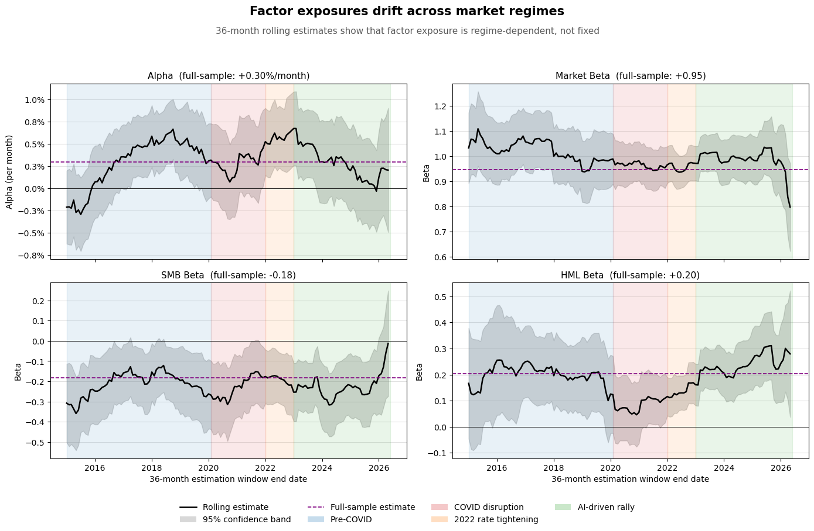
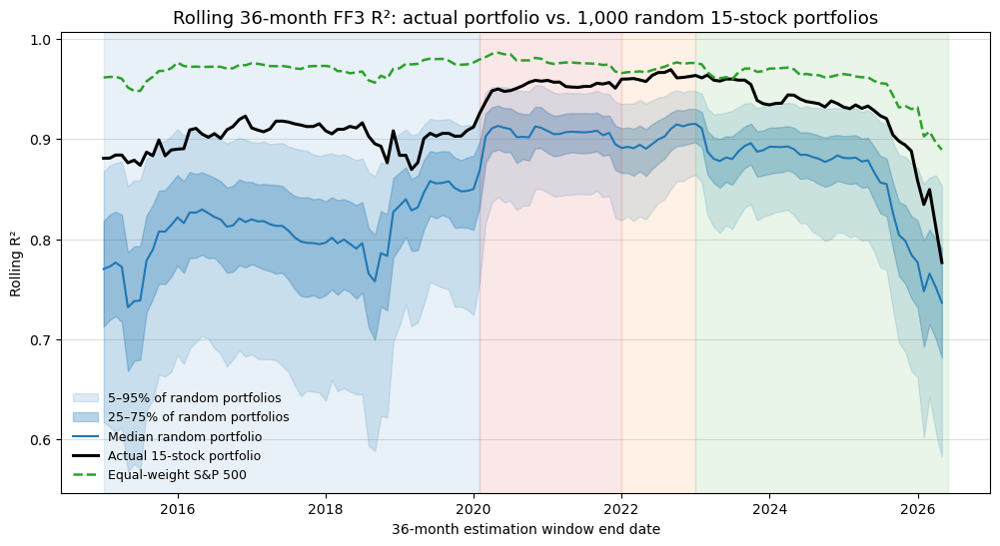

# Stability of Fama–French Factor Exposures Through Time

**Research question:** How stable are Fama–French three-factor exposures across market regimes — and when the model's fit deteriorates, is that a property of the portfolio or of the market?

This project estimates the Fama–French three-factor model

$$R_p - R_f = \alpha + \beta_M (MKT - RF) + \beta_S \cdot SMB + \beta_H \cdot HML + \epsilon$$

on an equal-weight portfolio of 15 large-cap U.S. equities (2012–2026, monthly), then stress-tests the "static exposures" assumption with rolling 36-month regressions, sub-period regressions across four regimes (pre-COVID, COVID disruption, 2022 rate tightening, AI-driven rally), and a 1,000-portfolio bootstrap drawn from the S&P 500 cross-section.

Everything lives in one annotated notebook: [`fama_french_3factor.ipynb`](fama_french_3factor.ipynb).

## Headline results

**1. Factor exposures drift across regimes.** Market beta is the most stable loading (≈0.95, near 1 throughout); SMB is persistently negative (the mechanical large-cap size tilt); HML is the least stable, swinging from ≈0.06 during COVID to ≈0.31 in the AI rally — despite the portfolio holding growth mega-caps, equal weighting gives it a value-like HML loading.



**2. The three-factor model lost explanatory power in the late AI rally — and the decline is market-wide, not stock-specific.** The portfolio's rolling R² fell ~0.19 from its post-2023 peak (0.96 → 0.78). The bootstrap fan of 1,000 random 15-stock portfolios fell by almost exactly as much (median ~0.18), and even the fully diversified equal-weight S&P 500 lost ~0.09. The actual portfolio rode *down with* the fan rather than sinking through it, so the rising idiosyncratic variance is a property of the whole large-cap cross-section, not of the AI names in this particular portfolio.



**Implication:** risk models and optimisers calibrated on a single historical window will mis-state factor risk — the estimation window itself is a modelling choice.

## Method

| Step | What it does |
|------|--------------|
| 1–2 | Download monthly factors (`Mkt-RF`, `SMB`, `HML`, `RF`) from the Kenneth French Data Library and prices from Yahoo Finance; build the equal-weight portfolio |
| 3 | Full-sample OLS with Newey–West (HAC) standard errors |
| 4 | Rolling 36-month regressions → time-varying alpha and betas |
| 5 | Separate regressions per regime + a dispersion-based stability summary (rolling std vs. full-sample SE) |
| 6–7 | Controls for the falling R²: equal-weight S&P 500 portfolio and per-stock rolling R² across ~438 full-history constituents (SPY is rejected as a control — its regression on `Mkt-RF` is near-tautological) |
| 8 | Bootstrap: 1,000 random equal-weight 15-stock portfolios from the same universe, giving the sampling distribution the actual portfolio should be judged against |

## Honest limitations

These are discussed at length in the notebook, and they're part of the point of the exercise:

- **Survivorship / look-ahead bias** — tickers were chosen today, so the positive alpha (+3.65%/yr full sample) says more about sample selection than market inefficiency. The betas, not the intercept, are the credible output.
- **Overlapping windows** — consecutive 36-month windows share 35 months, so rolling paths are serially dependent; they are a descriptive diagnostic, with formal inference left to the full-sample and sub-period regressions.
- **Short regimes** — the 2022 tightening window has ~12 observations for a 4-parameter regression; its estimates are indicative only.
- **Survivor universe** — the bootstrap fan is drawn from today's S&P 500 membership backfilled to 2012. Since survivorship biases *toward* well-behaved factor exposures, the observed R² decline is unlikely to be an artifact of it.

## Running it

```bash
pip install -r requirements.txt
jupyter notebook fama_french_3factor.ipynb
```

Run all cells top to bottom. The first run downloads factor data (Kenneth French Data Library via `pandas-datareader`) and prices (Yahoo Finance via `yfinance`), and scrapes current S&P 500 constituents from Wikipedia. S&P 500 prices are cached to `sp500_prices_cache.csv` next to the notebook — delete it to force a fresh download. The full first run (500-stock download + 1,000-portfolio bootstrap) takes a few minutes; subsequent runs are fast.

Results shown above are from the June 2026 run and will drift slightly as new months arrive.

## Data sources

- [Kenneth French Data Library](https://mba.tuck.dartmouth.edu/pages/faculty/ken.french/data_library.html) — `F-F_Research_Data_Factors` (monthly)
- Yahoo Finance (via `yfinance`) — monthly adjusted closes
- Wikipedia — current S&P 500 constituent list
